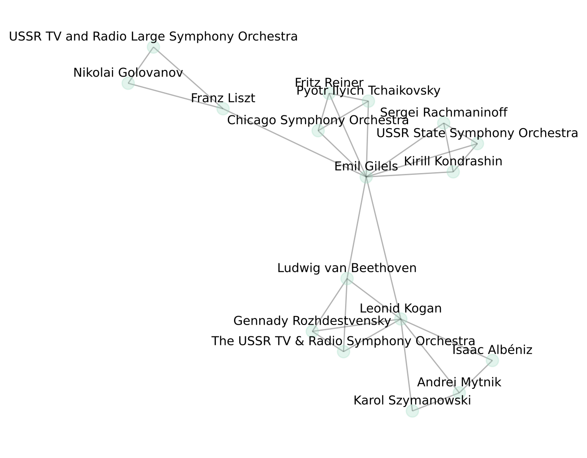

# Classical Musicians Recommender
This repository contains code for a recommendation system of classical music performers. The recommender is based on the idea that musicians with frequent collaborations likely have similar performance styles. It first creates a graph of classical musicians and their collaborations and uses node2vec embeddings to find vector representations of the musicians. Given a list of users' favorite artists, the recommender uses similarity of the vector representations to recommend artists that a user may enjoy.

The resulting recommender has been deployed as a web app: <a href="https://musicians-rec.herokuapp.com/">https://musicians-rec.herokuapp.com</a>

## Problem statement
Given a listener's favorite classical music performers, recommend other performers.  

Here is an example comparison of two artists (Vladimir Horowitz and Wilhelm Kempff) performing the same piece (Schumann Kinderszenen). 

https://user-images.githubusercontent.com/16123954/128429848-69fdec15-7430-447c-8189-f41e0b48d4f5.mov

https://user-images.githubusercontent.com/16123954/128429858-ed97c37e-4927-4a93-9ce9-1ccedd8fae38.mov

Note the stylistic difference in the performances. My goal was to build a recommendation system based on the style similarity of the performers. However, it seemed very challenging to create features that capture an artist's performance style. There may be some signal processing or computer vision techniques that can be useful in generating the features (to be explored in the future). For now, I decided to approach the problem from a different angle.  

## Solution overview
* My solution is to build a recommender based on artists' collaboration patterns. It is based on the idea that two performers who have many collaborative recordings tend to have compatible performance styles.  
* I used Spotify's API to build a graph representing classical musicians and their collaborations. Starting with my favorite artist 'Emil Gilels', I built the graph in a breadth-first search manner. Here is an example graph after exploring a few of Emil Gilel's albums.
 
 
* I then found an embedding of each musician via Node2Vec.
* Given a user's favorite artists, the recommender first computes the average vector of the favorite artists and recommends artists whose vector representation is similar to the average. 
* For details, please explore the Jupyter notebooks in this repository that are organized as follows:
1. build artist graph
2. explore graph properties
3. community detection
4. artist embedding via node2vec
5. build recommender
6. evaluation
7. hyperparameter tuning

#### Running Jupyter notebooks
1. Pull docker image: `docker pull irishryoon/musicians-recommendation` 
2. Download this repository and navigate to the corresponding directory.
3. Start a docker container: `docker run -p 8888:8888 -v "${PWD}":/home/jovyan/work irishryoon/musicians-recommendation`
4. Copy-paste the link that appears in the terminal. This should open a Jupyter notebook. Navigate to `/home/jovyan/work`

#### Methods used
* Breadth first search
* Community detection & graph analysis
* Self-supervised learning (node2vec, word2vec)

## Summary
* I built a classical musicians recommender based on artists' collaboration patterns. The main premise of this work is that artists that have multiple collaborative recordings tend to have compatible performance style. 

#### Some shortcomings
* The <b>graph generation process</b> is limited by the Spotify API. In particular:
  * The graph only reflects the recordings that are on Spotify. Furthermore, Spotify's API only returns at most 50 recordings per artist.
  * An artist may appear as multiple nodes because of typo and language. For example, 'Wiener Philharmoniker', 'Weiner Philharmoniker',  'ウィーンフィルハーモニー管弦楽団' all refer to the same orchestra but they appear as distinct nodes in the graph.
  * Some edge weights may be exaggerated if the same collaborative recording appears in two different albums. For example, consider two artists X and Y that have one collaborative recording. The recording may be included in two of artist X's albums, one titled "X plays Beethoven" and another titled "Best of X", where the second album is a compilation of popular recordings by X. In such cases, the edge weight between node X and Y will be 2, even though X and Y have only one recording together.      
* There are some shortcomings stemming from the assumption that <b>collaboration pattern approximates style similarity</b>.
    * The artists that are close to each other will, inevitably, be mostly contemporaries. Even if two artists, say artist X and Y, are stylistically very similar, their embeddings may be far if the artists are from two very different periods. 
    * The embedding may not be a good representation for artists with very few collaborative projects. In particular, their embeddings will be extremely close to their few collaborators. For example, if artist X has only one collaborator, say, Wolfgang Amadeus Mozart, then artist X will appear as one of the closest artists to Mozart. 
* It's difficult to <b>automate the parameter tuning</b> process since there isn't one metric that we can monitor (neither related artist nor the list of collaborators is the metric we want to optimize). If I had the resources, I would hire some classical music experts to submit 'similar artists' to a given list of artists and use that as the metric to optimize.

#### Some advantages
* Because the embeddings are learned from artists' collaboration patterns, artists that share collaborators will have similar embeddings.
* Once the embeddings are found, it's very quick to find artists that are similar to a listener's favorite artists.
    
## Future directions
* Cleaning up the graph: I plan on using NLP to identify nodes that represent the same artist and consolidate the nodes.
* Designing a better evaluation metric:
	* Instead of comparing the recommended artists to a list of collaborators, one can create a weighted evaluation metric so that a high score is assigned if a strong collaborator (collaborator with multiple shared albums) is recommended by the recommender.
	* I recently encountered this <a href="https://www.aicrowd.com/challenges/spotify-million-playlist-dataset-challenge">Spotify playlist dataset</a>. I plan on devising a new evaluation metric based on the users' listening history and playlists and re-running the hyperparameter tuning process using this metric. 
* Feature extraction: For artists with very few collaborators, one will have to rely on other features to find artists with a similar style. I plan on exploring some signal processing and computer vision tools to construct features that reflect the artist's performance style. I will then compare how such a feature-based recommendation system compares to the collaboration network-based recommender built in this project. 

## Contact
Iris Yoon  
<a href="irishryoon@gmail.com">irishryoon@gmail.com</a>  
<a href="irisyoon.org">irisyoon.org</a>
